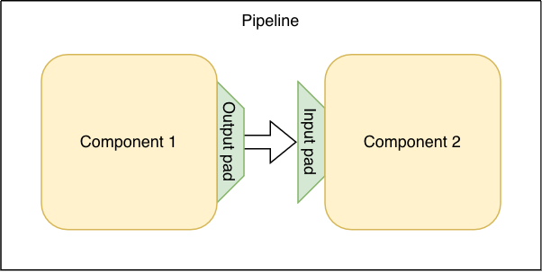
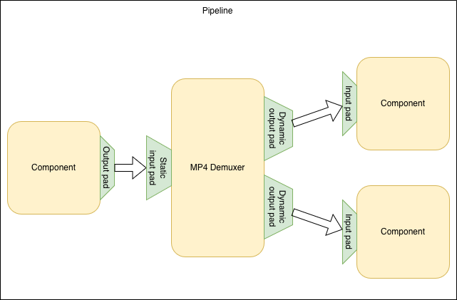
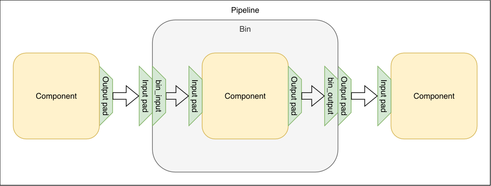

# Everything about pads

When developing intuition about the structure of pipelines, pads are
something that can't be ignored. If you think about elements and bins (from now
on collectively referred to as components) as some
sort of containers or boxes in which processing happens, then pads are the parts
that these containers are connected with.



There are some constraints regarding pads:

* A pad of one component can only connect to a single pad of another component.
  Only once these two pads are linked, communication through them can happen.
* One pad needs to be an input pad, and the other an output pad.
* The accepted formats of the pads need to match - stream formats passing
  between elements through these pads need to match the accepted formats of both.

When looking at the insides of components, the pads are their main way to
communicate with other components in the pipeline. There are four types
of information that can be exchanged between components through pads -
[stream formats](`t:Membrane.StreamFormat.t/0`),
[events](`t:Membrane.Event.t/0`), [buffers](`t:Membrane.Buffer.t/0`) and
`:end_of_stream`s.

When a component receives information of one of these types from another one, it receives
it on a pad. The reference to this pad is then also available as an argument
of the callback that handles the received information. For example, an invocation
of a [`handle_buffer/4`](`c:Membrane.Element.WithInputPads.handle_buffer/4`)
callback would mean that a buffer `buffer` has arrived on a pad `some_pad`:

```elixir
@impl true
def handle_buffer(some_pad, buffer, context, state) do 
  ...             ^^^^^^^^
end
```

When a component wants to send information to another
component in the pipeline, it should send it on a pad that's linked to it. It
can do that by using the pad reference in actions that send these types of
information, for example returning a
[`:buffer`](`t:Membrane.Element.Action.buffer/0`) action
from a callback would mean that a buffer `buffer` will be sent on a pad `some_pad`:

```elixir
@impl true
def handle_something(..., _context, state) do
  ...
  {[buffer: {some_pad, buffer}], state}
end          ^^^^^^^^
```

## Defining pads

To define what pads a component will have and how they'll behave, we use
[`def_input_pad/2`](`Membrane.Element.WithInputPads.def_input_pad/2`)
and [`def_output_pad/2`](`Membrane.Element.WithOutputPads.def_output_pad/2`) macros.
Input pads can only be defined for Bins, Sinks, Filters and Endpoints, and output
pads can only be defined for Bins, Sources, Filters and Endpoints.
The first argument for these macros is a name, which will then be used to
identify the pads. The second argument is a [pad spec](`t:Membrane.Pad.element_spec/0`)
keyword list, which is used to define how this pad will work. An option we'll
now focus on is [`availability`](`t:Membrane.Pad.availability/0`), which
determines if the pad is _static_ or _dynamic_.

### Static pads

Static pads are pretty straightforward - when a static pad is defined there
will always be exactly one instance of this pad and it's referenced by its
name.

#### File Source Example

An example of an element with only static pads is a [File Source](https://hexdocs.pm/membrane_file_plugin/Membrane.File.Source.html).
This element reads the contents of a file and sends them in batches through a static
output pad. The content of the buffers sent by this element is unknown - the file
that's being read can contain anything - so this pad has `:accepted_format` set to
`%RemoteStream{type: :bytestream}`. That means that any stream format that
matches on this struct can be sent on the output pad and this fact has to be
accounted for when linking a component after the source.

A pipeline spec with a file source passing buffers to an MP4 demuxer could look
like this:

```elixir
@impl true
def handle_init(_context, state) do
  spec = 
    child(:source, %Membrane.File.Source{location: "my_file.mp4"})
    |> via_out(:output)
    |> via_in(:input)
    |> child(:mp4_demuxer, Membrane.MP4.ISOM.Demuxer)

  {[spec: spec], state}
end
```

This spec will link a pad named `:output` of the source to a pad named
`:input` of the demuxer. However, this can be shortened - if an output pad is
called `:output` or an input pad is called `:input`, their respective
[`via_in/3`](`Membrane.ChildrenSpec.via_in/3`) and
[`via_out/3`](`Membrane.ChildrenSpec.via_out/3`) calls can be omitted and
Membrane will automatically recognize and link them:

```elixir
@impl true
def handle_init(_context, state) do
  spec = 
    child(:source, %Membrane.File.Source{location: "my_file.mp4"})
    |> child(:mp4_demuxer, Membrane.MP4.ISOM.Demuxer)

  {[spec: spec], state}
end
```

### Dynamic pads

Dynamic pads are a bit more complex. They're used when the number of pads of a
given type is variable - dependent on the processed stream or external factors.
The creation of these pads is controlled by the parent of the component - if a
[`:spec`](`t:Membrane.Pipeline.Action.spec/0`) action linking the dynamic pad is
being executed, then the pad is created dynamically and the component needs to
handle this, in most cases with
[`handle_pad_added/3`](`c:Membrane.Element.Base.handle_pad_added/3`). This
callback is called only for dynamic pads.

Another thing that's different is the way the pad are referenced. The pad's name can't just
be used as the pad's reference, because it wouldn't be unique. Dynamic pads are
identified by [`Pad.ref/2`](`Membrane.Pad.ref/2`), which takes the pad's
name and some unique reference as arguments. The result is a unique pad reference
that is also associated with a given pad's specification through its name. When
a new pad is linked, its reference is made known to the element through the
first argument of
[`handle_pad_added/3`](`c:Membrane.Element.Base.handle_pad_added/3`).

#### MP4 Demuxer Example

An example of an element using dynamic pads is an
[MP4 Demuxer](https://hexdocs.pm/membrane_mp4_plugin/Membrane.MP4.Demuxer.ISOM.html).
This element has an input pad, from which it receives the contents of an MP4
container, and output pads, on which it'll send the different tracks
that were in the container. The input pad can be static, however MP4 containers can
have different numbers and kinds of tracks, so the output pad needs to be dynamic.



We'll consider the case when we don't have any prior information about the
tracks in this MP4 container. Because of this, the parent pipeline or bin of this
demuxer won't initially know how many pads should be linked. To solve this
problem, the demuxer will identify the tracks in the incoming stream and send a
message to its parent in the form of
[`{:new_tracks, [{track_id :: integer(), content :: struct()}]}`](https://hexdocs.pm/membrane_mp4_plugin/Membrane.MP4.Demuxer.ISOM.html#t:new_tracks_t/0).
The list consists of tuples corresponding to tracks, where the first
element is a track id and will be used to identify the corresponding pad,
and the second is a stream format contained in the track.

Initially, the parent will only create the elements before and including the
demuxer:

```elixir
@impl true
def handle_init(_context, state) do
  spec = 
    child(:source, %Membrane.File.Source{location: "my_file.mp4"})
    |> child(:mp4_demuxer, Membrane.MP4.ISOM.Demuxer)

  {[spec: spec], state}
end
```

The source will start providing the demuxer with the MP4 container content,
from which the demuxer will identify tracks and notify its parent
about them. The parent now has to link an output pad of the demuxer for each
track received, which can look like this:

```elixir
@impl true
def handle_child_notification({:new_tracks, tracks}, :mp4_demuxer, _context, state) do
  spec = 
    Enum.map(tracks, fn {id, format} ->
        get_child(:mp4_demuxer)
        |> via_out(Pad.ref(:output, id))
        |> ...
      end)

  {[spec: spec], state}
end
```

The elements that the output pads will be linked to should be based on what stream
format is in the `format` variable - different formats require different approaches.

After this spec is returned, the demuxer will now have the
[`handle_pad_added/3`](`c:Membrane.Element.Base.handle_pad_added/3`) callback
called for each new linked pad:

```elixir
@impl true
def handle_pad_added(Pad.ref(:output, track_id), _context, state) do 
  ...
end
```

It will now know that these pads are linked and
ready to pass buffers forward.

An operation that's less common than linking dynamic pads, but also important,
is unlinking them. If the parent removed a child with
[`t:remove_children/0`](`t:Membrane.Pipeline.Action.remove_children/0`) action:

```elixir
@impl true
def handle_something(..., _context, state) do
  ...
  {[remove_children: :some_child], state}
end
```

Then the child with name `:some_child` would be stopped and removed from the
pipeline, unlinking all its pads. If an input pad of this child happened to be
connected to our demuxer, then the
[`handle_pad_removed/3`](`c:Membrane.Element.Base.handle_pad_removed/3`)
would be called in the demuxer with a reference to the pad that was unlinked:

```elixir
@impl true
def handle_pad_removed(Pad.ref(:output, unlinked_track_id), _context, state) do 
  ...
end
```

The demuxer should react to this information accordingly, for example it should
now know that it can no longer send buffers on this pad, because it has been
unlinked and essentially no longer exists.

If a link has dynamic pads on both sides, the parent could also return a
[`:remove_link`](`t:Membrane.Pipeline.Action.remove_link/0`) action,
which would only remove the link, resulting in
[`handle_pad_removed/3`](`c:Membrane.Element.Base.handle_pad_removed/3`)
being called in children on both sides of it.

## Life cycle of a pad

The life cycle of components is explored more broadly in this
[guide](components_lifecycle.md). Here, we'll take a closer look at the life
cycle of a pad, mostly focusing on elements.

### Creation

Static pads are essentially created and linked at the same time as the whole
component and exist alongside it for its entire lifespan - they have to be
linked at the same time the component is created.

Dynamic pads can be linked and unlinked throughout their components' lifespan.
There can also be multiple instances of a dynamic pad.
Because of this, each creation can be handled separately in
[`handle_pad_added/3`](`c:Membrane.Element.Base.handle_pad_added/3`) callback,
which is called every time a new dynamic pad is linked, and therefore
created.

### Playback

When an element is in `:stopped`
[playback](`t:Membrane.Playback.t/0`), nothing can be sent on its pads - the
pipeline is not ready. Only when an element enters `:playing` playback and
[`handle_playing/2`](`c:Membrane.Element.Base.handle_playing/2`) callback is
called can it assume that the pipeline is ready for communication and can
send on and receive information from its pads.

### Removal

Static pads are removed and unlinked only once their component is terminated.

Dynamic pads can be removed during the lifespan of their component. For each removal
a [`handle_pad_removed/3`](`c:Membrane.Element.Base.handle_pad_removed/3`)
callback is called.

## Pads in bins

We know that when it comes to linking pads between components, bins behave just like
elements. However, when we take a look inside them, they are pretty different.
While elements can interact with information moving through their pads
directly with callbacks, bins are only containers for other components. They
don't interact with information moving through their pads directly, they forward
it to components inside them.

The insides of a bin can be thought of as a pipeline of sorts. The components
are created with the [`:spec`](`t:Membrane.Bin.Action.spec/0`) action and the bin is
their parent. The way that these components can send and receive information on the bin's
pads is by linking with [`bin_input`](`Membrane.ChildrenSpec.bin_input/1`) and
[`bin_output`](`Membrane.ChildrenSpec.bin_output/2`). These functions can be
thought of as the "interior" part of the bin's pad.



For example, if a bin has
a dynamic input pad called `:input`, and a single static output pad called `:output`,
it can behave like this:

```elixir
@impl true
def handle_setup(_ctx, state) do
  spec = 
    child(:comp, SomeComponent)
    |> bin_output(:output)

  {[spec: spec], state}
end
```

When the bin is being set up, it creates a `SomeComponent` child named `:comp`,
which connects its output pad to the `bin_output` corresponding to the bin's
`:output` pad. Now whenever this child sends or receives something on its output pad,
it's received by or sent to whatever component is connected to the bin's
`:output` pad.

```elixir
@impl true
def handle_pad_added(Pad.ref(:input, id) = pad, _ctx, state) do
  spec = 
    bin_input(pad)
    |> child(SomeOtherComponent)
    |> get_child(:comp)
  
  {[spec: spec], state}
end
```

Every time a new input pad of the bin is created, the
[`handle_pad_added/3`](`c:Membrane.Bin.handle_pad_added/3`) callback is called.
The bin has to connect this pad to something within a 5-second timeout,
otherwise a `LinkError` will be
raised. A new `SomeOtherComponent` child is created and its input pad is
connected to a `bin_input` corresponding to the newly created pad. Now whenever
this child sends or receives something on its input pad, it's received by or
sent to whatever component is connected to the bin's newly created pad.

It's worth noting that pads of bins are only an abstraction. When a component
links with a bin, it actually links directly to the components inside of it to
avoid unnecessary forwarding of messages.
