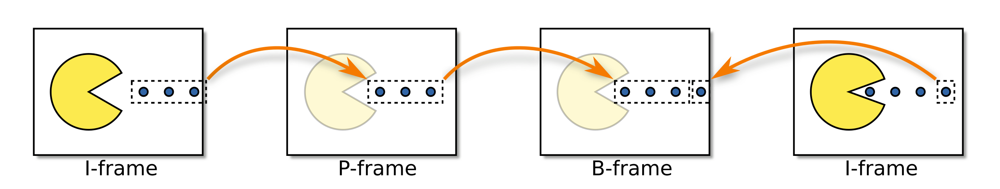

# Timestamps

In a nutshell, timestamps determine when a given event occurred (or should occur)
in time. For example, when you take a photo with your phone, the exact time and
date the photo is taken is recorded - it's a timestamp. When dealing with media
we also need a way to tell when different things need to happen. In Membrane we
use the two most common types of timestamps:

* PTS (Presentation Time Stamp) - determines when the media should be
  displayed.
* DTS (Decoding Time Stamp) - informs the decoder when the media should
  be decoded.

## Time in Membrane

We know that timestamps represent the time of occurrence of an event, but these
concepts are pretty abstract. We need to somehow represent them in the context
of our framework. To represent time - durations, latencies, timestamps, - we
use terms of type `t:Membrane.Time.t/0`:

* To create a term representing some amount of time, we use
  `Membrane.Time.<unit>/0` and `Membrane.Time.<unit>s/1` functions. For example,
  to create a term representing three seconds, we call `Membrane.Time.seconds(3)`.
* To read the amount of time represented, we can use `Membrane.Time.as_<unit>/2`
  functions. For example, to get an amount of milliseconds represented by a time,
  we call `Membrane.Time.as_milliseconds(some_time)`

## Carriers of timestamps

We now have a way to represent timestamps, but to be useful, they have to refer
to something, an event of some sort. Media streams in
Membrane are packaged in [Buffers](`t:Membrane.Buffer.t/0`) when sent
between elements. A buffer is a struct with 4 fields:

* `:payload` - data contained in the buffer
* `:pts` and `:dts` - timestamps assigned to the buffer
* `:metadata` - metadata describing the contents of the buffer

A buffer often corresponds to some unit which the stream is composed of, for
example video frames in raw video streams or RTP packets in RTP streams.
These units finally can have timestamps assigned to them - and in
most cases they do. For example, a PTS assigned to a buffer containing a
raw video frame determines when the frame should be displayed.

## Presentation Time Stamps (PTS)

As previously mentioned, PTSs are used to tell when a piece of media should be
presented to the user. It can mean either displaying a video frame, or playing a
chunk of audio.

### Realtimer

[Realtimer](https://hexdocs.pm/membrane_realtimer_plugin/Membrane.Realtimer.html)
is an element from
[membrane_realtimer_plugin](https://hex.pm/packages/membrane_realtimer_plugin).
It takes in a stream and limits its flow according to its PTSs. For example, if
it receives three buffers with `:pts` of 0ms, 200ms and 400ms, then it will send
the first buffer, the second buffer after 200ms pass, and the third one after
another 200ms pass.

This element is useful if we have non-realtime input, and realtime output, for
example we want to stream the contents of a MP4 file with WebRTC. If we didn't
use Realtimer, then we would read the contents of the file as fast as possible and
send them over as fast as possible, which is not something we want. We want the receiver
to get the stream in realtime, so that they can display it as it comes.

## Decode Time Stamps (DTS)

The purpose of DTSs is to tell a decoder when a frame should be
decoded. In a lot of codecs the media can be decoded as it comes, but in some
cases, like in [H264](../membrane_tutorials/h264/1_Introduction.md), it's
not that simple. In a nutshell, in H264 some frames are encoded based on
information from other frames. There are three main types of frames:

* I-frame (Intra-coded picture) - A frame of this type is encoded without the
  information from any other frames. Sometimes referred to as a _keyframe_.
* P-frame (Predicted picture) - A frame of this type is encoded with the usage
  of information from previous frames. If we have a static scene, then it takes
  much less space to encode a frame by using the fact that it's almost the
  same as the previous one and encoding only the things that have changed.
* B-frame (Bidirectional predicted picture) - A frame of this type is similar
  to a P-frame, as it uses information from other frames for its encoding.
  However, it not only depends on previous pictures, but also on future ones.
  That's where the DTSs come in, because to decode a B-frame we also need to
  decode all frames it's based on, including the future ones.

For example, let's assume that we have a slice of a stream from the diagram,
consisting of four frames. Frames 1 and 4 are I-frames, frame 2 is a P-frame
depending on frame 1, and frame 3 is a B-frame depending on frames 2 and 4.
If a decoder receives these frames with the following timestamps:

* [1] pts: 0ms, dts: 0ms
* [2] pts: 200ms, dts: 200ms
* [4] pts: 600ms, dts: 400ms
* [3] pts: 400ms, dts: 600ms

It will first decode the frames in order (1, 2, 4, 3), according to their DTSs.
If it hadn't decoded frames 2 and 4 first, it couldn't have decoded frame 3.
It's also important to note that DTSs should always be monotonic, while PTSs
for streams with B-frames can be non-monotonic.

## Tips and guidelines

Dealing with timestamps can be complicated and very different depending on the
use case, so here is some advice on dealing with them:

* Filters should always forward timestamps.
* If a filter doesn't use timestamps, it should forward them, but not rely on
them being set.
* Sources should attach timestamps to buffers whenever they're known.
* Whenever possible, elements should rely on timestamps instead of
framerate or audio duration calculated from the stream.
* If an element queues buffers in its state (or uses a library that does so), it
should make sure that the timestamps for the output buffers are the same as for
the corresponding input buffers.
* You should ensure that calculations on timestamps don't introduce an
accumulating error. Prefer using rationals (Ratio library) to floats.
* Elements should generate deterministic output timestamps for better testability.
* If an element transforms N input buffers into M output buffers, each of the
output buffers should have either:
  * the timestamp of the first of the input buffers (even if only a part of it
  was used to construct the output buffers).
  * more precise timestamps, if it's possible to calculate them.
* Timestamps are harder than they seem and are the source of many bugs, including:
  * Audio/video desynchronization
  * Stream hanging (due to waiting indefinitely to process/play a buffer because
  of a wrong timestamp)
  * Stream stalls (e.g. due to processing a real-time stream slightly faster
  than real-time)
  * Memory leaks (e.g. due to processing a real-time stream slightly slower
  than real-time and indefinite buffering)
  * Video flickering (due to incorrect handling of B-frames)
  * Audio cracking

  Therefore, operations on timestamps should be given a lot of care and be well-tested.
